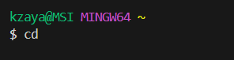
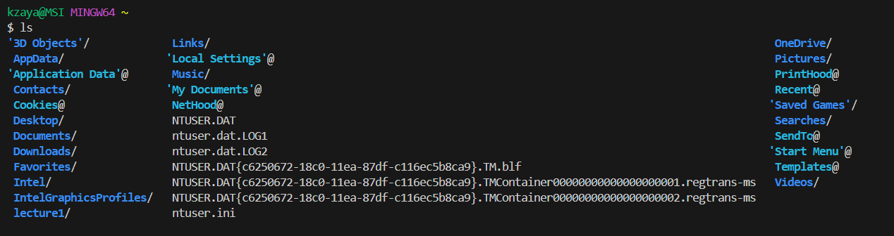
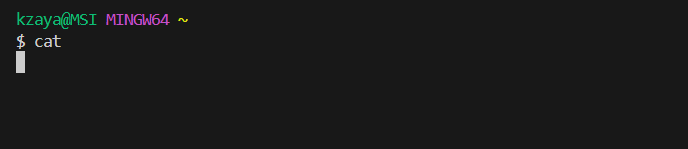
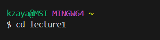
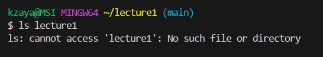
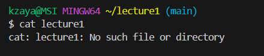
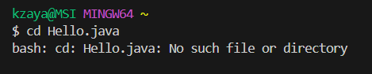
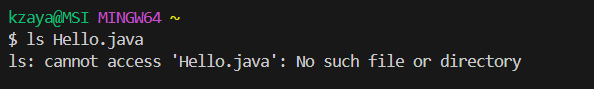
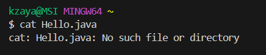

## Lab Report 1
* 
  
  Absolute Path: kzaya@MSI MINGW64 ~

* 
  
  Absolute Path: kzaya@MSI MINGW64 ~
  
* 

  Absolute Path: kzaya@MSI MINGW64 ~
  
* 

  Absolute Path: kzaya@MSI MINGW64 ~
  
* 
  
  Absolute Path: kzaya@MSI MINGW64 ~
  
* 

  Absolute Path: kzaya@MSI MINGW64 ~
  
* 

  Absolute Path: kzaya@MSI MINGW64 ~
  
* 

  Absolute Path: kzaya@MSI MINGW64 ~
  
* 

  Absolute Path: kzaya@MSI MINGW64 ~
